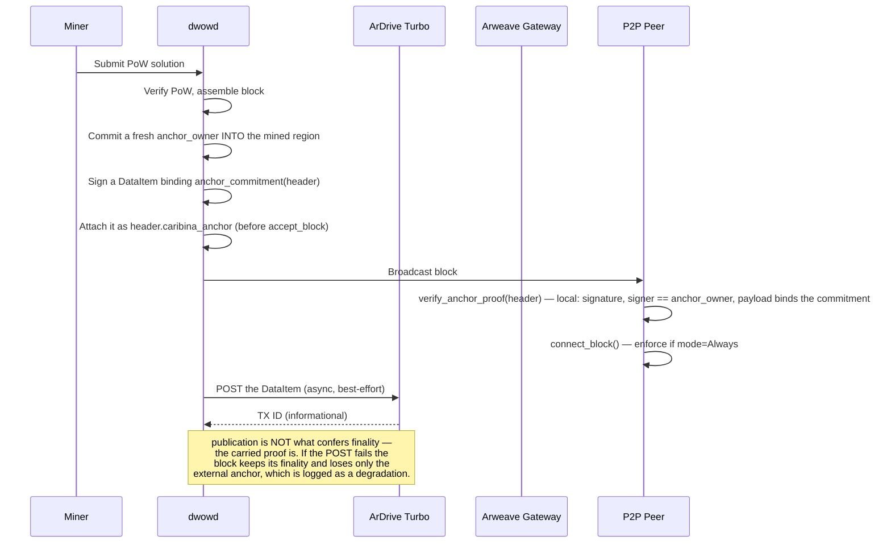
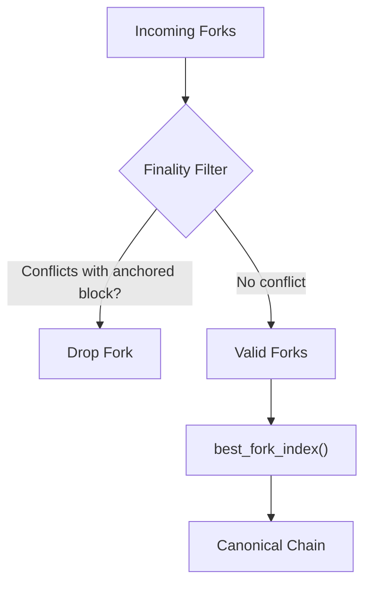
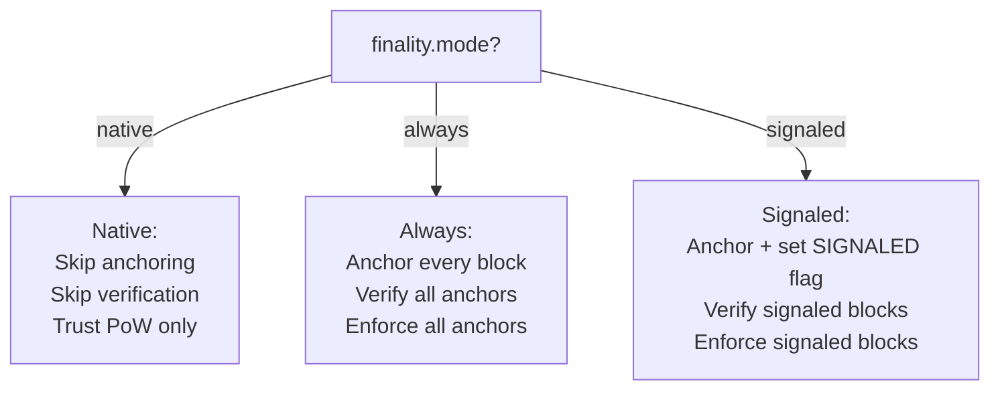

# Caribina — Arweave-Anchored Finality Widget

Caribina is an **independent finality layer** for DarkWow that anchors blocks to
Arweave's proof-of-storage consensus chain. It provides a second, orthogonal
hardening barrier against 51% attacks — completely separate from RandomX PoW
and the Monero merge-mining anchor.

Unlike the Monero anchoring finality gadget (which requires p2pool merge mining),
Caribina works for **all** miners — native RandomX miners and merge miners alike.
No p2pool, no Monero node, no AR token funding required.

## Motivation

A 51% attacker who controls the majority of RandomX hashpower can rewrite DarkWow's
chain history. The Monero anchoring finality gadget protects against this, but only
for blocks that reference a confirmed Monero anchor — which requires running p2pool
and a Monero node.

Caribina adds a completely independent finality path:

- **Free**: ArDrive Turbo accepts small uploads (< 100KB) from unfunded wallets
- **Trivial key cycling**: Per-block Ed25519 key generation takes microseconds
- **No infrastructure**: Just an HTTP POST to ArDrive Turbo

An attacker who controls RandomX hashpower cannot forge Arweave timestamps.
Arweave uses proof-of-storage consensus — a completely different mechanism.

> **Settlement is not checked, by design (2026-09-22).** Earlier text here advertised "settlement in
> ~2 minutes (1 DarkWow block)" and the docs described settlement as what makes a block final. Nothing
> checks it, and it cannot be a consensus rule: settlement lives on another chain, and consensus must be
> a pure function of local data — the same reason `verify_monero_anchor` is uncallable from consensus.
> What the anchor actually establishes is **publication**: the miner committed a key inside the block's
> mined region, signed a DataItem binding that block, and published it. That is the property the 51%
> argument needs, because the adversary in scope cannot delete a DataItem. Settlement depth — whether
> Arweave has buried it — is Arweave's own business and this chain does not read it. `OBL-C66` records
> this as **accepted-with-reason** rather than open, so the gap is stated rather than implied.

## How It Works

```
Miner finds block at height H with hash B
    │
    ▼
1. Generate fresh Ed25519 keypair (microseconds) — its public half becomes `anchor_owner`
2. Commit `anchor_owner` into the **mined region**, then find the nonce
3. Build an ANS-104 DataItem binding `anchor_commitment(header) || height || timestamp`
4. Sign it with that fresh key
5. Attach the signed DataItem to the block as `header.caribina_anchor`
6. Accept the block — the proof is already in it
7. Broadcast
    │
    ▼
Other nodes verify, **locally**:
   a. The block carries an anchor proof at all
   b. It commits a non-zero `anchor_owner`
   c. The DataItem's signature is valid AND its signer is that committed owner
   d. Its payload binds `anchor_commitment(header)`, the height and the timestamp
   e. If all pass → the block is final (cannot be reorganized)
    │
    ▼
Publication (asynchronous, and not a dependency):
   f. POST the DataItem to https://upload.ardrive.io/v1/tx/arweave
   g. If it fails, the block keeps its finality and logs a degradation
```

**Steps (a)–(d) are `caribina::verify_anchor_proof`, called from both enforcement sites** — pure, local,
no gateway and no RandomX VM, which is why consensus can call it. The `c` check is the one that makes the
anchor *the miner's*: an Ed25519 signature is self-consistent under any key, so a proof is only evidence
about a block if its signer is the key that block's mined region commits.

The gateway path (`verify_anchor`, steps that would `GET` the DataItem by id) still exists and is the
**opt-in live-conformance arm**, not a consensus input. It is not needed for verification, because the
proof travels with the block.

## ANS-104 DataItem Format

Caribina uses Arweave's ANS-104 binary transaction format with Ed25519 signatures
(signature type 2):

```
Bytes   0-1:  signature_type = 2 (u16 LE)
Bytes  2-65:  signature (64 bytes, Ed25519)
Bytes 66-97:  owner / public key (32 bytes)
Byte     98:  target presence (always 0)
Byte     99:  anchor presence (always 0)
Bytes100-107: tag count (u64 LE, 0 for minimum overhead)
Bytes108-115: tag bytes (u64 LE, 0 for minimum overhead)
Bytes  116+:  data payload (block_hash || timestamp || height = 48 bytes)
```

Total: 164 bytes per anchor. Well within ArDrive Turbo's free tier (< 100KB).

Signature data is computed using Arweave's **deepHash** construction
(SHA-384 merkle-like accumulation over the list of DataItem fields).

## deepHash Construction

Per ANS-104 §2.1, the signing data is:

```
deepHash(["dataitem", "1", "2", owner, target, anchor, tags, data])
```

Where:
- `deepHash(list)` = pair-wise SHA-384 accumulation tagged with "list" + count
- `deepHash(blob)` = SHA-384(tag || SHA-384(data)) where tag = SHA-384("blob" + length)

The Arweave transaction ID is `SHA-256(raw_signature)` — the raw 64-byte
signature bytes, not the full DataItem.

## Fork Choice with Caribina

Caribina adds a **finality constraint** to fork choice, identical in structure to
the Monero anchoring gadget:

```
Forks → [Finality Filter: drop forks conflicting with finalized blocks]
              │
              ▼
         Valid forks → best_fork_index() by targets_rank, hashes_rank
              │
              ▼
         Best fork becomes canonical
```

A block is anchored when it carries a **verified anchor proof**: `header.anchor_owner` (a fresh per-block
Ed25519 key, inside the mined region) signed a DataItem that binds `anchor_commitment(header)`, and that
DataItem rides in the block as `header.caribina_anchor`. Such a block is **final** and cannot be replaced
by any competing fork — even one with superior PoW rank.

The finality check in `connect_block()` (`src/linear/src/chain_state.rs:1011`), verbatim — **as of
2026-09-22**, the same predicate appearing at `:1546` in `detect_reorg` so the two sites cannot disagree:
```rust
if self.finality_config.should_enforce(existing.header.finality_flags)
    && caribina::verify_anchor_proof(&existing.header)
{ return Err(LinearError::AnchoredBlockConflict); }
```

`verify_anchor_proof` is a **pure local function** — no network, no RandomX VM — so it can be called from
consensus. It requires four things, each closing a way a peer could manufacture finality for a block it
did not mine:

1. the block carries an anchor proof at all;
2. it commits a non-zero `anchor_owner`, which is **inside the mined region**, so a relaying peer cannot
   swap it without redoing the proof-of-work;
3. the DataItem's signature is valid **and its signer is that committed owner** — a signature is
   self-consistent for any key, so without this comparison anyone could publish an anchor under their own
   key for somebody else's block;
4. its payload binds `anchor_commitment(header)`, the block's height and its timestamp, so a proof
   published for a *different* block cannot be reused here.

An unverifiable anchor confers **no** finality and — deliberately — does **not** reject the block:
rejecting would let any peer halt the chain with a malformed relay, whereas ignoring the claim costs only
that block's finality. Before this, the predicate read `anchor_tx_id != 0 || anchor_monero_height != 0`,
two fields the relaying peer chooses and nothing authenticated, outside the mined region — so any peer
could make a block permanently un-replaceable for free. That was `OBL-C63` and `OBL-C64`.

## Integration Points

| Component | What it does | Status |
|-----------|-------------|--------|
| **Miner process** (`bin/dwowd/src/lib.rs` `miner_task`) | Builds the proof after the nonce and attaches it **before** `accept_block`; publishes asynchronously | live (2026-09-22) |
| **Miner RPC** (`bin/dwowd/src/rpc/miner.rs`) | Same shape. Before this it anchored in a detached task that never touched the header, so every block it committed was unanchored | live (2026-09-22) |
| **Stratum** (`bin/dwowd/src/rpc/stratum.rs`) | Builds and attaches the proof after PoW verification and before insert; publishes with `linear_submit_lock` **released** | live (`OBL-C68` fixed) |
| **P2P Handler** (`bin/dwowd/src/proto/linear_broadcast.rs`) | — | **does not exist**: zero occurrences of `anchor` or `finality`. This row claimed the opposite until 2026-09-22 |
| **Blockchain** (`src/linear/src/chain_state.rs`) | Rejects insertion of a block carrying a **verified** anchor proof, at two sites that share one predicate | live, verified (2026-09-22) |
| **Verification** (`src/linear/src/caribina/verify.rs`) | `verify_anchor_proof` — pure and local, called from both enforcement sites. `verify_anchor` (gateway fetch) remains the opt-in live-conformance arm | live |
| **BlockHeader** (`src/linear/src/block.rs`) | Carries `anchor_owner: [u8; 32]` (**inside** the mined region) and `caribina_anchor: Option<Vec<u8>>`; still carries `anchor_tx_id`, `anchor_monero_height`, `anchor_monero_hash`, `finality_flags` | live |

**What is inside the mining blob and what is not, and why.** `anchor_owner` is inside it, because it is
generated *before* mining and is what authenticates the anchor: a relayer cannot re-attribute a proof
without redoing the proof-of-work. The other fields are outside it, because they are set *after* the nonce
is found and must not invalidate the solution they annotate. That is safe now because nothing decides
finality from them — the enforcement predicate above reads the verified proof, and `anchor_tx_id` carries
the genesis network magic rather than a finality signal.

## Finality Flow



**The peer verifies locally and needs no gateway.** Before 2026-09-22 it verified nothing at all — it
enforced on header fields it received, and the diagram showed a `GET` that no code performed. Note also
which arrow is *not* a dependency: the POST happens after the block is built and never gates acceptance,
so an Arweave outage cannot stall the chain.

## Fork Choice with Finality Filter



## Mode Decision Flow



## Configuration

Finality is configured per-network in `dwowd_config.toml`, with CLI flags
available to override.

### TOML Configuration

```toml
[network_config."darkwow-testnet".finality]
# Mode: "always" (default) | "native" | "signaled"
mode = "always"

# Enable Caribina Arweave anchoring (default: true)
caribina_enabled = true

# Enable Monero anchoring via p2pool (default: false)
monero_enabled = false

# Monero confirmations before finality (default: 3)
monero_min_confirmations = 3

# monerod JSON-RPC URL for full anchor verification (optional)
# monerod_url = "http://127.0.0.1:18081/json_rpc"
```

### CLI Flags

All TOML settings can be overridden from the command line:

```
--finality-mode <MODE>
    Finality enforcement mode: "always" (default), "native", or "signaled"
    - always: Anchor every mined block to Arweave and enforce anchors on received blocks
    - native: Trust PoW only — ignore all anchors
    - signaled: Only enforce finality when a block signals it requires it

--finality-disable-caribina
    Disable Caribina Arweave anchoring entirely

--finality-enable-monero
    Enable Monero p2pool anchoring (default: false)

--monero-min-confirmations <N>
    Monero confirmations required before finality (default: 3)

--monerod-rpc-url <URL>
    monerod JSON-RPC endpoint for full anchor verification
    (e.g. http://127.0.0.1:18081/json_rpc)
```

CLI flags take precedence over TOML. Example:

```bash
# Run with native mode (no finality) — useful for testing
dwowd --network darkwow-testnet --finality-mode native

# Disable only Caribina anchoring, keep enforcement
dwowd --network darkwow-testnet --finality-disable-caribina

# Enable Monero p2pool anchoring with full monerod verification
dwowd --network darkwow-testnet --finality-enable-monero \
    --monerod-rpc-url http://127.0.0.1:18081/json_rpc
```

### Mode Reference

| Mode | Mine with anchor? | Verify on receive? | Enforce on conflict? |
|------|:---:|:---:|:---:|
| **native** | No | No | No — trust PoW only |
| **always** (default) | Yes (Caribina + Monero if enabled) | Yes | Yes — all anchored blocks |
| **signaled** | Yes + flag | Only signaled | Only signaled |

### Default Behavior

By default, nodes run in **always** mode with **Caribina enabled**. This means:

- Every mined block is anchored to Arweave
- Every received block with a non-zero `anchor_tx_id` is verified
- Anchored blocks cannot be replaced (enforced at `connect_block()`)
- No configuration required — maximum resilience out of the box

To disable finality entirely (e.g. for local testing where Arweave HTTP calls
are unwanted latency):

```bash
dwowd --finality-mode native
```

The `signaled` mode is designed for gradual adoption: miners opt in per-block
by setting the `FINALITY_SIGNALED` flag. Nodes in signaled mode only enforce
finality on blocks that carry the flag — un-signaled blocks follow normal PoW
fork choice.

## Comparison with Monero Anchoring

| Property | Monero Anchor (p2pool) | Caribina (Arweave) |
|----------|----------------------|---------------------|
| Status | **anchoring live; the anchor fields are never set and the Monero block's own PoW is never checked** (`OBL-C67`), so a fabricated merge-mined block is accepted | **anchoring and verification live** (2026-09-22); enforcement requires a verified proof |
| Requires p2pool | Yes | No |
| Requires Monero node | Yes, and `get_block_by_hash` is being added for the admission policy | No |
| Requires funding | No (merge mining) | No (ArDrive free tier) |
| Settlement | Not read by this chain — nor is Arweave settlement; see the note above | Not read by this chain, by design (`OBL-C66`, accepted) |
| Consensus mechanism | RandomX PoW | Proof-of-Storage |
| Key management | Monero wallet | Per-block Ed25519 cycle |
| Protects native miners | No | Yes |
| Protects merge miners | Yes | Yes |
| Verification | Nothing yet; `verify_monero_anchor` cannot run in consensus (network-bound) | `verify_anchor_proof` — pure and local, called from both enforcement sites |

## Toy Model Results

The merge mining toy model (`contrib/docker/darkwow-testnet/merge_mining_model.py`)
includes Caribina as `ConsensusMode.CARIBINA`. Under a 51% attack with 10x attacker
hashpower:

| Mode | Blocks replaced | Blocks protected | Attacker fork |
|------|----------------|-----------------|---------------|
| **NATIVE** | 5/5 (100%) | 0 | Accepted |
| **ANCHOR** (Monero) | 1/5 (20%) | 4 | Accepted (partial) |
| **CARIBINA** (Arweave) | 0/5 (0%) | 5 | **Rejected** |

> **Read that table as a statement about the model, not about the node.** Its numbers were produced by a
> model whose Caribina settlement was measured against `current_height` — the very chain the attacker is
> rewriting — and whose anchors were assumed real. That made the CARIBINA column circular: a 51% miner
> advanced its own anchors toward finality by mining.
>
> **That was corrected on 2026-09-22.** Settlement is now counted in **Arweave** blocks against
> Arweave's own height, advanced by `ArweaveChainState` on wall-clock time, and an anchor must be
> *authentic* — the key that signed the DataItem has to be the key the block's mined region commits —
> before it confers anything. The corrected model has tests for both properties plus one that pins the
> superseded circular rule and asserts the two rules disagree, so the circularity cannot return
> silently.
>
> **The numbers above survived the correction unchanged**, and the node now implements the model's rule
> (reproduce the table with `python3 contrib/docker/darkwow-testnet/merge_mining_model.py`, a gate in
> `scripts/run-all-tests.sh`). Two things are worth keeping straight now that both halves have moved:
>
> - **The model's rule and the node's rule are not identical, and should not be.** The model counts
>   settlement in Arweave blocks; the node does **not** count settlement at all, because it cannot
>   (`OBL-C66`, accepted). What the node enforces is the model's *authenticity* half — a verified anchor
>   proof from the key the block commits — which is the half that does the work in the table above. So the
>   numbers survive for a reason the model states and the node enforces, not by coincidence.
> - **This was the whole point of correcting the model.** Its earlier rule measured settlement on the
>   chain under attack, so a 51% miner advanced its own anchors toward finality by mining, and the table
>   could not have distinguished a real result from that circularity. Nothing before the correction could
>   have told the difference.

## Source Files

| File | Purpose |
|------|---------|
| `src/linear/src/caribina/mod.rs` | Module root |
| `src/linear/src/caribina/data_item.rs` | ANS-104 DataItem binary format |
| `src/linear/src/caribina/wallet.rs` | Ed25519 key generation and signing |
| `src/linear/src/caribina/anchor.rs` | ArDrive Turbo HTTP POST |
| `src/linear/src/caribina/verify.rs` | Arweave gateway verification |
| `src/linear/src/block.rs` | `anchor_tx_id` field in BlockHeader |
| `src/linear/src/chain_state.rs` | Finality constraint in `connect_block()` |
| `src/linear/src/consensus.rs` | PoW consensus (unchanged — Caribina is a constraint overlay) |
| `bin/dwowd/src/rpc/miner.rs` | Mining integration |
| `bin/dwowd/src/rpc/stratum.rs` | Stratum integration |
| `bin/dwowd/src/proto/linear_broadcast.rs` | P2P verification |

## See Also

- [Monero Merge Mining](monero-merge-mining.md) — the p2pool-based finality layer
- [Merge Mining Toy Model](../../../contrib/docker/darkwow-testnet/merge_mining_model.py) — includes CARIBINA consensus mode
- [Toy Model README](../../../contrib/docker/darkwow-testnet/merge_mining_model_README.md)
- [ANS-104 Specification](https://github.com/ArweaveTeam/arweave-standards/blob/master/ans/ANS-104.md)
- [ArDrive Turbo](https://ardrive.io/turbo/)
