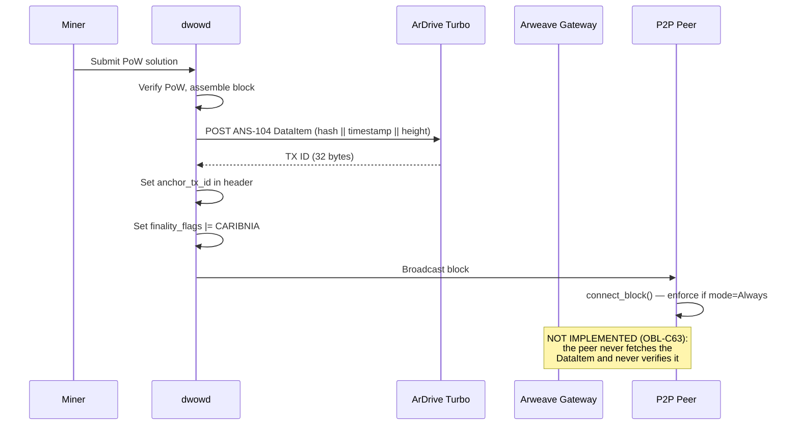
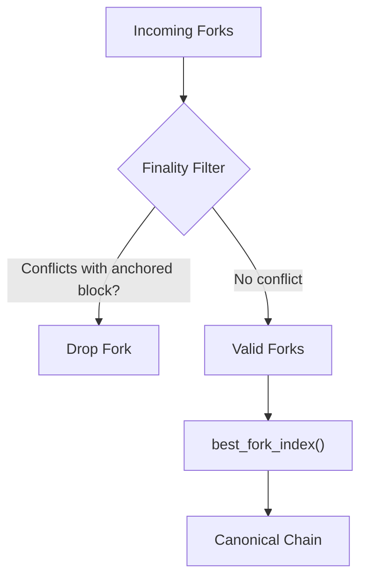
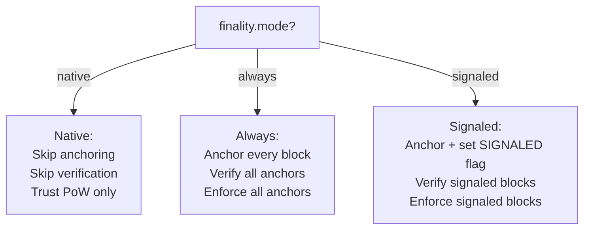

# Caribina — Arweave-Anchored Finality Widget

Caribina is an **independent finality layer** for DarkWow that anchors blocks to
Arweave's proof-of-storage consensus chain. It provides a second, orthogonal
hardening barrier against 51% attacks — completely separate from RandomX PoW
and the Monero merge-mining anchor.

Unlike the Monero anchoring finality gadget (which requires p2pool merge mining),
Caribina works for **all** miners — native RandomX miners and merge miners alike.
No p2pool, no Monero node, no AR token funding required.

## Motivation

A 51% attacker who controls the majority of RandomX hashpower can rewrite DarkWow's
chain history. The Monero anchoring finality gadget protects against this, but only
for blocks that reference a confirmed Monero anchor — which requires running p2pool
and a Monero node.

Caribina adds a completely independent finality path:

- **Free**: ArDrive Turbo accepts small uploads (< 100KB) from unfunded wallets
- **Trivial key cycling**: Per-block Ed25519 key generation takes microseconds
- **Fast settlement**: Arweave blocks finalize in ~2 minutes (1 DarkWow block)
  vs ~6 minutes for Monero anchoring (3 Monero blocks)
- **No infrastructure**: Just an HTTP POST to ArDrive Turbo

An attacker who controls RandomX hashpower cannot forge Arweave timestamps.
Arweave uses proof-of-storage consensus — a completely different mechanism.

## How It Works

```
Miner finds block at height H with hash B
    │
    ▼
1. Generate fresh Ed25519 keypair (microseconds)
2. Build ANS-104 DataItem containing: block_hash || timestamp || height
3. Sign DataItem with the fresh key
4. POST signed DataItem to https://upload.ardrive.io/v1/tx/arweave
5. Receive TX ID (32-byte SHA-256 of signature)
6. Set anchor_tx_id in block header
7. Broadcast block
    │
    ▼
Other nodes verify:
   a. Fetch TX by ID from Arweave gateway (GET {ARWEAVE_GATEWAY}/{tx_id})
   b. Check: stored data contains correct block_hash + height + timestamp
   c. Check: the payload's own timestamp is within ±30 min of the block timestamp
   d. Check: Ed25519 signature is valid
   e. If all pass → block is final (cannot be reorganized)
```

> **Steps (a)–(d) are implemented in `src/linear/src/caribina/verify.rs` and are not called anywhere in
> `bin/dwowd`.** `verify_anchor` is reachable only from `caribina/integration_tests.rs`. What is live is
> step (e)'s *enforcement* — see "Fork Choice with Caribina" below — which reads the header fields
> without consulting any of this. Read `OBL-C63`–`OBL-C66` in the
> [verification obligation register](verification-hazop.md) before relying on this section.
>
> Note also that (c) is weaker than "the Arweave block containing the DataItem has settled": it compares
> the payload's timestamp — which the anchoring miner chose — against the block's, and never fetches the
> Arweave block. Settlement is not established by any code (`OBL-C66`).

## ANS-104 DataItem Format

Caribina uses Arweave's ANS-104 binary transaction format with Ed25519 signatures
(signature type 2):

```
Bytes   0-1:  signature_type = 2 (u16 LE)
Bytes  2-65:  signature (64 bytes, Ed25519)
Bytes 66-97:  owner / public key (32 bytes)
Byte     98:  target presence (always 0)
Byte     99:  anchor presence (always 0)
Bytes100-107: tag count (u64 LE, 0 for minimum overhead)
Bytes108-115: tag bytes (u64 LE, 0 for minimum overhead)
Bytes  116+:  data payload (block_hash || timestamp || height = 48 bytes)
```

Total: 164 bytes per anchor. Well within ArDrive Turbo's free tier (< 100KB).

Signature data is computed using Arweave's **deepHash** construction
(SHA-384 merkle-like accumulation over the list of DataItem fields).

## deepHash Construction

Per ANS-104 §2.1, the signing data is:

```
deepHash(["dataitem", "1", "2", owner, target, anchor, tags, data])
```

Where:
- `deepHash(list)` = pair-wise SHA-384 accumulation tagged with "list" + count
- `deepHash(blob)` = SHA-384(tag || SHA-384(data)) where tag = SHA-384("blob" + length)

The Arweave transaction ID is `SHA-256(raw_signature)` — the raw 64-byte
signature bytes, not the full DataItem.

## Fork Choice with Caribina

Caribina adds a **finality constraint** to fork choice, identical in structure to
the Monero anchoring gadget:

```
Forks → [Finality Filter: drop forks conflicting with finalized blocks]
              │
              ▼
         Valid forks → best_fork_index() by targets_rank, hashes_rank
              │
              ▼
         Best fork becomes canonical
```

A block with `anchor_tx_id != [0u8; 32]` is considered anchored. Once the Arweave
block containing it settles (default: 1 DarkWow block), the block is **final** and
cannot be replaced by any competing fork — even one with superior PoW rank.

The finality check in `connect_block()` (`src/linear/src/chain_state.rs:1011`), verbatim:
```rust
if self.finality_config.should_enforce(existing.header.finality_flags)
    && (existing.header.anchor_tx_id != [0u8; 32]
        || existing.header.anchor_monero_height != MoneroBlockHeight::new(0))
{ return Err(LinearError::AnchoredBlockConflict); }
```

Two consequences of that predicate are worth naming where the code is quoted, because they are what
`OBL-C63` and `OBL-C64` are about. It consults **no proof**: `should_enforce` is a function of the mode
and the block's own flags, and nothing here calls `verify_anchor`. And `anchor_monero_hash` is absent
from it, so a Monero height with a zero hash is enough to trigger enforcement.

## Integration Points

| Component | What it does | Status |
|-----------|-------------|--------|
| **Miner** (`bin/dwowd/src/rpc/miner.rs`) | Anchors after PoW, in a detached background task, before broadcast | live |
| **Stratum** (`bin/dwowd/src/rpc/stratum.rs`) | Anchors after PoW verification, before insert — synchronously and under `linear_submit_lock` | live, blocks submissions (`OBL-C68`) |
| **P2P Handler** (`bin/dwowd/src/proto/linear_broadcast.rs`) | — | **does not exist**: the file contains zero occurrences of `anchor` or `finality`. This row claimed the opposite until 2026-09-22 (`OBL-C63`) |
| **Blockchain** (`src/linear/src/chain_state.rs`) | Rejects insertion of a block claiming an anchor — without verifying the claim | live, unverified (`OBL-C63`) |
| **Verification** (`src/linear/src/caribina/verify.rs`) | Fetches the DataItem, checks the signature and the payload | **dead code outside tests** (`OBL-C63`) |
| **BlockHeader** (`src/linear/src/block.rs`) | Carries `anchor_tx_id: [u8; 32]` (zero = no anchor), plus `anchor_monero_height`, `anchor_monero_hash`, `finality_flags` | live |

The four finality fields are **excluded from the mining blob** — `anchor_tx_id` is set after PoW is
found, so the block hash does not change after anchoring. That has a consequence the earlier text did
not draw out: proof-of-work is over the blob, so it authenticates none of those four fields, and one
PoW solution admits unlimited distinct headers differing only in them. A relaying peer can strip, swap
or invent an anchor at no cost. See `OBL-C64`.

## Finality Flow



**Only the top half of that diagram is real.** The peer performs no `GET`, no signature check and no
payload comparison; it enforces on the header fields it received. The dashed-from-none steps are drawn
in the note rather than as messages because a sequence diagram that shows them as messages is how the
gap stayed invisible.

## Fork Choice with Finality Filter



## Mode Decision Flow



## Configuration

Finality is configured per-network in `dwowd_config.toml`, with CLI flags
available to override.

### TOML Configuration

```toml
[network_config."darkwow-testnet".finality]
# Mode: "always" (default) | "native" | "signaled"
mode = "always"

# Enable Caribina Arweave anchoring (default: true)
caribina_enabled = true

# Enable Monero anchoring via p2pool (default: false)
monero_enabled = false

# Monero confirmations before finality (default: 3)
monero_min_confirmations = 3

# monerod JSON-RPC URL for full anchor verification (optional)
# monerod_url = "http://127.0.0.1:18081/json_rpc"
```

### CLI Flags

All TOML settings can be overridden from the command line:

```
--finality-mode <MODE>
    Finality enforcement mode: "always" (default), "native", or "signaled"
    - always: Anchor every mined block to Arweave and enforce anchors on received blocks
    - native: Trust PoW only — ignore all anchors
    - signaled: Only enforce finality when a block signals it requires it

--finality-disable-caribina
    Disable Caribina Arweave anchoring entirely

--finality-enable-monero
    Enable Monero p2pool anchoring (default: false)

--monero-min-confirmations <N>
    Monero confirmations required before finality (default: 3)

--monerod-rpc-url <URL>
    monerod JSON-RPC endpoint for full anchor verification
    (e.g. http://127.0.0.1:18081/json_rpc)
```

CLI flags take precedence over TOML. Example:

```bash
# Run with native mode (no finality) — useful for testing
dwowd --network darkwow-testnet --finality-mode native

# Disable only Caribina anchoring, keep enforcement
dwowd --network darkwow-testnet --finality-disable-caribina

# Enable Monero p2pool anchoring with full monerod verification
dwowd --network darkwow-testnet --finality-enable-monero \
    --monerod-rpc-url http://127.0.0.1:18081/json_rpc
```

### Mode Reference

| Mode | Mine with anchor? | Verify on receive? | Enforce on conflict? |
|------|:---:|:---:|:---:|
| **native** | No | No | No — trust PoW only |
| **always** (default) | Yes (Caribina + Monero if enabled) | Yes | Yes — all anchored blocks |
| **signaled** | Yes + flag | Only signaled | Only signaled |

### Default Behavior

By default, nodes run in **always** mode with **Caribina enabled**. This means:

- Every mined block is anchored to Arweave
- Every received block with a non-zero `anchor_tx_id` is verified
- Anchored blocks cannot be replaced (enforced at `connect_block()`)
- No configuration required — maximum resilience out of the box

To disable finality entirely (e.g. for local testing where Arweave HTTP calls
are unwanted latency):

```bash
dwowd --finality-mode native
```

The `signaled` mode is designed for gradual adoption: miners opt in per-block
by setting the `FINALITY_SIGNALED` flag. Nodes in signaled mode only enforce
finality on blocks that carry the flag — un-signaled blocks follow normal PoW
fork choice.

## Comparison with Monero Anchoring

| Property | Monero Anchor (p2pool) | Caribina (Arweave) |
|----------|----------------------|---------------------|
| Status | **anchoring live, anchor fields never set** — `mm_rpc.rs:630-631` writes zeroes, so the gadget has never been in effect (`OBL-C67`) | **anchoring live, verification dead code** (`OBL-C63`) |
| Requires p2pool | Yes | No |
| Requires Monero node | Yes (for full verification) | No |
| Requires funding | No (merge mining) | No (ArDrive free tier) |
| Settlement time | ~6 min (3 Monero blocks) | ~2 min (1 DarkWow block) |
| Consensus mechanism | RandomX PoW | Proof-of-Storage |
| Key management | Monero wallet | Per-block Ed25519 cycle |
| Protects native miners | No | Yes |
| Protects merge miners | Yes | Yes |
| Verification | monerod RPC or plausibility — **never called** (`OBL-C63`) | Arweave gateway HTTP — **never called** (`OBL-C63`) |

## Toy Model Results

The merge mining toy model (`contrib/docker/darkwow-testnet/merge_mining_model.py`)
includes Caribina as `ConsensusMode.CARIBINA`. Under a 51% attack with 10x attacker
hashpower:

| Mode | Blocks replaced | Blocks protected | Attacker fork |
|------|----------------|-----------------|---------------|
| **NATIVE** | 5/5 (100%) | 0 | Accepted |
| **ANCHOR** (Monero) | 1/5 (20%) | 4 | Accepted (partial) |
| **CARIBINA** (Arweave) | 0/5 (0%) | 5 | **Rejected** |

> **Read that table as a statement about the model, not about the node.** The model's
> `get_caribina_finalized_blocks` finalises on `has_caribina and caribina_tx_id is not None` — it assumes
> the anchor is real — and measures settlement against `current_height`, the very chain the attacker is
> rewriting. The Rust implements a *weaker* rule than the model (no authentication at all), and the model
> implements a rule the Rust has no data to support (it carries no real anchor). So the table is not
> evidence about DarkWow; it is evidence that the model's premise was never checked against the code.
> Correcting both, and pinning one to the other with a conformance fixture, is `OBL-C63` and `OBL-C66`.

## Source Files

| File | Purpose |
|------|---------|
| `src/linear/src/caribina/mod.rs` | Module root |
| `src/linear/src/caribina/data_item.rs` | ANS-104 DataItem binary format |
| `src/linear/src/caribina/wallet.rs` | Ed25519 key generation and signing |
| `src/linear/src/caribina/anchor.rs` | ArDrive Turbo HTTP POST |
| `src/linear/src/caribina/verify.rs` | Arweave gateway verification |
| `src/linear/src/block.rs` | `anchor_tx_id` field in BlockHeader |
| `src/linear/src/chain_state.rs` | Finality constraint in `connect_block()` |
| `src/linear/src/consensus.rs` | PoW consensus (unchanged — Caribina is a constraint overlay) |
| `bin/dwowd/src/rpc/miner.rs` | Mining integration |
| `bin/dwowd/src/rpc/stratum.rs` | Stratum integration |
| `bin/dwowd/src/proto/linear_broadcast.rs` | P2P verification |

## See Also

- [Monero Merge Mining](monero-merge-mining.md) — the p2pool-based finality layer
- [Merge Mining Toy Model](../../../contrib/docker/darkwow-testnet/merge_mining_model.py) — includes CARIBINA consensus mode
- [Toy Model README](../../../contrib/docker/darkwow-testnet/merge_mining_model_README.md)
- [ANS-104 Specification](https://github.com/ArweaveTeam/arweave-standards/blob/master/ans/ANS-104.md)
- [ArDrive Turbo](https://ardrive.io/turbo/)
