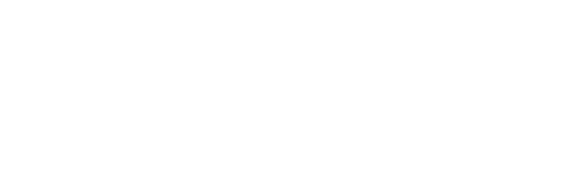
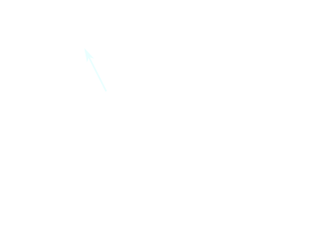

# Event Graph

> **Status: Active.** The event graph is the P2P messaging DAG used by
> [darkirc](../../misc/darkirc/darkirc.md) for decentralized chat and by
> [evgrd](../../../../script/evgrd/src/lib.rs) as a standalone event graph
> daemon. It is **not** part of the legacy DAG blockchain consensus — that
> was replaced by [Uncle Merkle consensus](../consensus/uncle_merkle.md).
> The event graph is an independent P2P primitive for message passing and
> has no dependency on the blockchain execution layer.
>
> The event graph is formalized in the ρ-calculus as `ProtocolEventGraph`
> (see [Type System §10.3](../type-system.md#103-event-graph-path--dag-sync)):
> four concurrent tasks — `handle_event_put | handle_event_req | handle_tip_req |
> broadcast_rate_limiter` — spawned via `ProtocolJobsManager` at
> `src/event_graph/proto.rs:161-164`. Blockchain events can route through
> the event graph via the bridging mechanism (see
> [Type System §10.4](../type-system.md#104-bridging--shared-channels-with-typed-barbs)):
> blockchain messages wrapped with marker byte `0x42` in event content.

Event graph is a syncing mechanism between nodes working asynchronously.

 
The graph here is a DAG (Directed Acyclic Graph) in which the nodes 
(vertices) are user created and pushed events and the edges are the 
parent-child relation between the two endpoints.

The main purpose of the graph is synchronization. This allows nodes in 
the network maintain a fully synced store of objects. How those objects 
are interpreted is up to the application.

Each node is read-only and this is an append-only data structure. 
However the application may wish to prune old data from the store to 
conserve memory.

## Synchronization

When a new node joins the network it starts with a genesis event, and 
will:
1. ask for all connected peers for their unreferenced events (tips).
2. Compare received tips with local ones, identify which we are missing.
3. Request missing tips from peers.
4. Recursively request events backwards.

We always save the tree database so once we restart before next 
rotation we reload the tree and continue from where we left off 
(previous steps 1 through 4).

We stay in sync while connected by properly handling a new received 
event, we insert it into our dag and mark it as seen, this new event 
will be a new unreferenced event to be referenced by a newer event
if we for some reason didn't receive the event, we will be requesting 
it when reciveing newer events as we don't accept events unless we have 
their parents existing in our dag.

Synchronization task should start as soon as we connect to the p2p network.

## Sorting events

We perform a topological order of the dag, where we convert the dag 
into a sequence starting from the erlier event (genesis) to the later.

Since events could have multiple parents, there is no uniqe ordering of 
this dag, meaning events in the same layer could switch places in the 
resulted sequence, to overcome this we introduce timestamps as metadata 
of the events, we do `Depth First Search` (DFS) of the graph for every 
unreferenced tip to ensure visiting every event and sort them based on 
thier timestamp.

In case of a tie in timestamps we use event id to break the tie.

## Creating an Event

Typically events are propagated through the network by rebroadcasting 
the received event to other connected peers.

In this example A creates a new event and boradcast it to its connected 
peers (B nodes), and those in turn rebroadcast it to their connected 
peers (C nodes), and so on, until every single node has received the 
event.
1. `Node A` creates a new event.
2. `Node A` sends `event` to $B_1, \dots, B_n$
3. For each $B_i$ in $\{B_1, \dots, B_n\}$:
    1. validate the event (is it older than genesis, time drifted, malicous or 
    not, etc..).
    2. Check if we already have the event. also check if we have all of 
    its parents.
    3. request missing parents if any and add them to the DAG.
    4. if all the checks pass we add the actual received event to the DAG.
    5. Relay the event to other peers.

## Genesis Event

All nodes start with a single hardcoded genesis event in their graph. 
The application layer should ignore this event. This serves as the 
origin event for synchronization.

## Storage: sled-overlay quarantine

The event graph stores events using `sled-overlay` (overlay/diff/inverse-diff
semantics on top of sled). This introduces non-determinism in DAG operations
(batched writes via overlays can produce different intermediate states).

**This is acceptable here because:**
- The event graph is a P2P messaging layer, not a blockchain execution layer
- Non-determinism in message ordering/arrival is inherent to P2P networks
- Events are idempotent (keyed by blake3 hash) — replay heals any inconsistency
- No consensus or state-machine replication depends on the event graph

**Quarantine boundary:** `sled-overlay` is gated behind the `event-graph`
Cargo feature flag. It must **never** be enabled by any blockchain
execution-layer feature (`blockchain`, `linear`) or binary (`dwowd`).
The execution layer follows a strictly deterministic design philosophy:
plain `sled` trees with direct writes, no overlays, no speculative state,
no rollback. Same input = same result every time.

This boundary is enforced in:
- `Cargo.toml` — the `event-graph` feature is the only feature that enables `sled-overlay`
- `src/lib.rs` — the `event_graph` module is the only consumer, with a quarantine doc comment
- `src/rpc/from_impl.rs` — JSON serialization impls are gated on `event-graph`

