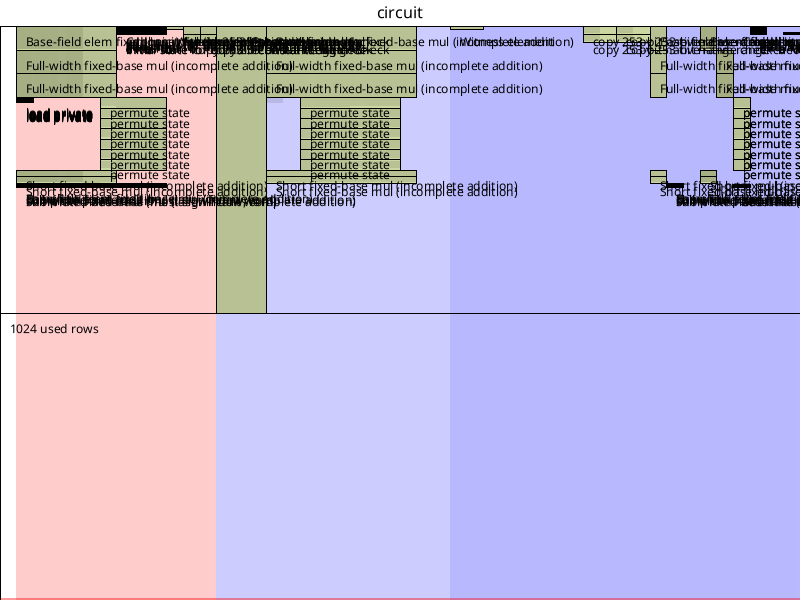

# Writing ZK Proofs

> **Note:** The zkas compiler and zkVM described here are inherited from upstream DarkFi. The toolchain, language syntax, and proof format are shared with upstream and track upstream changes.

ZK proofs in DarkWow are written in a simple low level
[DSL](https://en.wikipedia.org/w/index.php?title=Domain-specific_language).
The zkas compiler then converts this human readable code into bytecode
that is run on the DarkWow ZKVM.

## Zkas Usage

To build zkas, run:
```
make zkas
```
We can then see the help output with `zkas -h`.

To compile a `.zk` file, simply run:
```
$ zkas proof/opcodes.zk
Wrote output to proof/opcodes.zk.bin
```
It's worth running `zkas -i proof/opcodes.zk` to get a sense of what
instructions the bytecode will send to the VM. We can also see the data
structure with `-e` as well.

## Structure of a ZK File

Take a look at existing ZK files in `proof/` directory for examples.
See also `src/contract/dao/proof/` and `src/contract/money/proof/`.
In all of those directories is a `witness/` subdirectory containing
witness JSON files that can be used with the zkrunner and zkrender tools below.

`k = ...` indicates the number of rows which is $2ᵏ$. Bigger values make
your proof slower, whereas if `k` is too low then the proof generation will
fail. Pick a value that works and find the minimum allowed. Usually 11 to 13
works.

`field = "pallas"` indicates the base field.

The `constant` section specifies any constants we use.

`witness` section contains the witnesses provided when generating the proof.

`circuit` specifies the actual instructions for the proof.

## Generating a ZK Proof in Rust

When compiling you will need to use the `zk` feature in cargo.
Check `tests/zkvm_opcodes.rs` for an example to follow along with.

The broad steps are:

1. Create your witness values, and put them in an array. The order must match
   what is set in the `.zk` file.
2. Calculate the public values from the private witnesses. This must be
   an array of the same type (usually `pallas::Base`).
3. Load the bytecode and generate the ZK proof.
4. Optionally you can verify it.

## Debugging ZK Files

The first thing you should do is export a JSON file to run with the debugger.
You can do this by adding this line into Rust.
```rust
zk::export_witness_json("witness.json", &prover_witnesses, &public_inputs);
```
Then after running the code, you should now have a file called `witness.json`.

Then run the ZK debugger.
```
./bin/zkrunner/zkrunner.py -w witness.json --prove --trace foo.zk
```
where `foo.zk` is our `.zk` file we're debugging.

Often this works, but the ZK proof is failing when used with a WASM contract.
In that case the culprit is that the WASM code is exporting the wrong
public values. Use the `msg!()` macro to print them to the program's output
log, and compare it with the public values you see in the `witness.json`
from when the proof was created. This will allow you to pinpoint exactly
where the error occurs.

For example files to try, see the comment in the section above
[Structure of a ZK File](structure-of-a-zk-file).

## Viewing the ZK Circuit Layout

ZK circuit have a layout. The less empty space, the more efficient is your
circuit. Usually it just means reducing the `k` value specified. The number of
rows in your circuit is $2ᵏ$, so reducing the value by 1 will halve the number
of rows.

To generate an image of the circuit layout, simply run:

```
./bin/zkrunner/zkrender.py -w src/contract/dao/proof/witness/exec.json src/contract/dao/proof/exec.zk /tmp/layout.png
```

You should see something like:



## Public Key Derivation Pattern

When deriving public keys from secrets in circuits, you **must** use `constrain_equal_base` to bind the derived coordinates to public inputs. This prevents a vulnerability where a malicious prover could claim any public key without knowing the corresponding secret.

**Required Pattern**:

```zk
witness "Example" {
    Base secret,
    Base pub_x,      # Public input witness
    Base pub_y,      # Public input witness
}

circuit "Example" {
    # Derive public key from secret
    pub = ec_mul_base(secret, NULLIFIER_K);
    derived_pub_x = ec_get_x(pub);
    derived_pub_y = ec_get_y(pub);

    # CRITICAL: Bind derived coordinates to public inputs
    constrain_equal_base(derived_pub_x, pub_x);
    constrain_equal_base(derived_pub_y, pub_y);

    # Now expose as public inputs
    constrain_instance(pub_x);
    constrain_instance(pub_y);
}
```

**Common Mistake** (vulnerable):

```zk
# WRONG: Missing constrain_equal_base binding
pub = ec_mul_base(secret, NULLIFIER_K);
pub_x = ec_get_x(pub);
pub_y = ec_get_y(pub);
constrain_instance(pub_x);  # No binding! Vulnerable!
constrain_instance(pub_y);  # No binding! Vulnerable!
```

A pre-commit hook at `hooks/pre-commit` automatically detects this vulnerability and rejects commits containing it.

**See Also**: [Public Key Constraint Hook](../arch/pubkey-constraint-hook.md)

